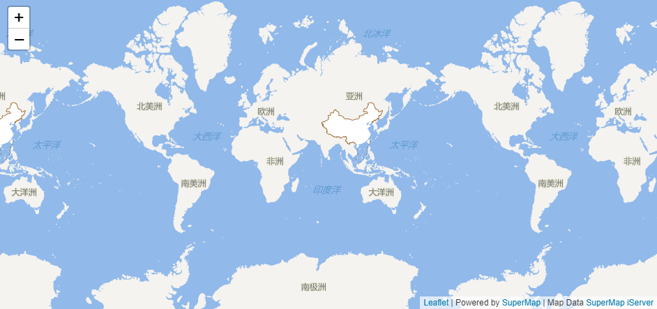

# supermap-leaflet 已停止维护！

## 请前往[https://github.com/SuperMap/iClient-JavaScript](https://github.com/SuperMap/iClient-JavaScript)查看。

# SuperMap Leaflet

[](https://github.com/SuperMap/supermap-leaflet)
[](./LICENSE)

## Introduction
[leaflet]:http://leafletjs.com
[supermap-leaflet]:https://github.com/SuperMap/supermap-leaflet
[introduce]:http://iclient.supermap.io/introduction/leaflet.html#introduce
[sourcecode]:https://github.com/SuperMap/iClient9/tree/master/src/leaflet

&nbsp;&nbsp;<font style="font-weight:bolder;font-size:16px;">English：</font> [SuperMap Leaflet][supermap-leaflet] is a part of [SuperMap iClient for Leaflet][introduce] , and can also be used as plugins for [Leaflet][leaflet] for working with  SuperMap service types. 

&nbsp;&nbsp;<font style="font-weight:bolder;font-size:16px;">中文：</font>[SuperMap Leaflet][supermap-leaflet] 是 [SuperMap iClient for Leaflet][introduce] 产品的一部分，包含了部分功能 ，同时也属于[Leaflet][leaflet]的一个插件。

* website：[http://iclient.supermap.io/introduction/leaflet.html#introduce][introduce]

* source code：[https://github.com/SuperMap/iClient9/tree/master/src/leaflet][sourcecode]

Requires Leaflet v1.0.0 or later.

## Demos
Live [Demo](http://supermap.github.io/supermap-leaflet/example/tiledMapLayer.html).


## Example
Here is an example you can put into your own .html file.


```html
    <!DOCTYPE html>
    <html>
    <head>
        <meta charset="UTF-8">
        <title>SuperMap  Leaflet TiledMapLayer</title>
        <link rel="stylesheet" href="http://cdn.bootcss.com/leaflet/1.1.0/leaflet.css">
        <script type="text/javascript" src="http://cdn.bootcss.com/leaflet/1.1.0/leaflet.js"></script>
        <script type="text/javascript" src="../dist/SuperMapLeaflet.js"></script>
    </head>
    <body style=" margin: 0;width: 100%;height:100%;position: absolute;top: 0;bottom: 0">
    <div id="map" style="margin:0 auto;width: 100%;height: 100%"></div>
    <script type="text/javascript">
        var map, url = "http://support.supermap.com.cn:8090/iserver/services/map-china400/rest/maps/China";
        map = L.map('map').setView([0, 0], 1);
        L.supermap.tiledMapLayer(url).addTo(map);
    </script>
    </body>
    </html>
```
        
## API Reference
We only provide tiled map module in this version.More exciting modules are coming soon.

- List of API
   - [TiledMapLayer](#tiledmaplayer)
   - coming soon

### TiledMapLayer

Used to load and display tile layers on the map. Extends L.TileLayer.

Usage example:

```javascript
   L.supermap.tiledMapLayer("http://<server>:<port>/iserver/services/<serviceName>/rest/maps/<mapName>").addTo(map);
```
Creation

    L.supermap.tiledMapLayer(url, options);
    
### Options
  The settings on the list are the request parameters for the server map resource, and they all become part of the URL.
 
  option            | type           | default     |description                                                                        
  ------------------|----------------|-------------|------------ 
  `token`           | string         |  null       | iServer service Token                                                              
  `layersID`        | string         |  null       | If not null,it means to use theme map under iServer map service which specifies by layersID 
  `width`           | int            |  256        | Tile width from Server
  `height`          | int            |  256        | Tile height from Server
  `prjCoordSys`     | Object         |  null       | Map's dynamic projection coordinate system. e.g.: {"epsgCode":3857}
  `overlapDisplayed`| Boolean        |  true       | Whether the map objects are overlap display in the same range
  `overlapDisplayedOptions`| Object        |  null       | Overlap display filter options,valid only if 'overlapDisplayed' is false.See also [overlapDisplayedOptions](http://support.supermap.com.cn:8090/iserver/help/html/zh/mergedProjects/iServerJavadoc/com/supermap/services/components/commontypes/OverlapDisplayedOptions.html)
  `tileversion`     | String         |  null       | Tile set version,valid only if 'cacheEnabled' is true.
  `redirect`        | Boolean        |  false      | If true , it will request the image's real url address
  `cacheEnabled`    | Boolean        |  true       | If true,the tiles images will use iServer cache,it will be faster to display whole map  
  `transparent`     | Boolean        |  false      | Whether the tile is transparent.If true,the tile from server will be transparent;otherwise,is will be white

Options inherited from [TileLayer options](http://leafletjs.com/reference-1.1.0.html#tilelayer-option)  


## License
Licensed under the Apache License, Version 2.

A copy of the license is available in the repository's [LICENSE](./LICENSE) file.
